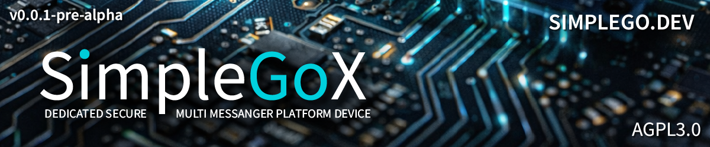

<p align="center">
  
</p>

<p align="center">
  <h1 align="center">SimpleGoX</h1>
</p>

<p align="center">
  <strong>Open-source multi-messenger platform unifying Matrix, Telegram, SimpleX and WhatsApp in one secure inbox.</strong><br>
  Free desktop client plus dedicated hardware messenger devices with secure elements and verified boot.<br>
  Built with Rust, Tauri v2 and Svelte. All cryptography runs natively - encryption keys never touch the WebView.
</p>

<p align="center">
  
  <a href="LICENSE"></a>
  <a href="https://matrix.org"></a>
  <a href="https://core.telegram.org"></a>
  <a href="https://www.rust-lang.org"></a>
  <a href="https://v2.tauri.app"></a>
</p>

> **Early development (pre-alpha).** SimpleGoX is under active development. Features are incomplete, APIs will change, and bugs are expected. Not ready for daily use. Contributions and feedback are very welcome!

---

## What is SimpleGoX?

SimpleGoX is a multi-messenger platform that brings Matrix, Telegram, SimpleX and WhatsApp together in one app. All your chats from all protocols appear in a single list, sorted by last activity. You never switch between apps.

Each protocol runs as its own isolated native process on your machine. Your Telegram keys stay in the Telegram process. Your Matrix encryption runs in Rust outside the browser. Nothing is bridged through a server. Nothing leaves your device.

The long-term vision goes beyond desktop: SimpleGoX is designed to run on dedicated hardware terminals with secure elements, tamper detection and hardened Linux - a physical messenger device you own and control. See [ARCHITECTURE_AND_SECURITY.md](ARCHITECTURE_AND_SECURITY.md) for the complete security architecture spanning from silicon to user interface.

### How it works

Unlike Beeper which bridges everything through Matrix on a cloud server, SimpleGoX connects to each protocol natively on the client side using isolated sidecar processes that communicate over gRPC. Zero shared memory between protocols. No server-side bridges. No cloud proxy.

### The SimpleGoX ecosystem

| Product | Description | Status |
|:--------|:------------|:-------|
| **SimpleGoX Desktop** | Multi-messenger client for Windows, Linux and macOS | Pre-alpha |
| **SimpleGoX Hardware** | Dedicated messenger devices in 3 security classes | Planning |
| **[SimpleGoX Chat](https://github.com/saschadaemgen/SimpleGoX-Chat)** | Embeddable E2E-encrypted website chat widget | Planned |
| **[SimpleGoX ESP](https://github.com/saschadaemgen/SimpleGoX-ESP)** | ESP32 IoT devices that speak Matrix natively | In development |

SimpleGoX is the successor to [SimpleGo](https://github.com/saschadaemgen/SimpleGo) (ESP32 hardware messenger) and [GoChat](https://github.com/saschadaemgen/GoChat) (browser chat widget), now built on the Matrix protocol with multi-messenger support.

---

## Protocols

| Protocol | Status | Implementation |
|:---------|:-------|:---------------|
| **Matrix** | Working | Native Rust via matrix-rust-sdk 0.16 + vodozemac |
| **Telegram** | Working | TDLib 1.8.61 via tdlib-rs in isolated sidecar process |
| **SimpleX** | Planned | Native Rust SMP implementation |
| **WhatsApp** | Planned | Official EU DMA interoperability path |

---

## Why SimpleGoX?

**One inbox, four protocols.** Matrix and Telegram chats appear side by side in a single chat list, sorted by last activity. Protocol badges (MX, TG) and chat type badges (Grp, Ch) show where each chat lives and what kind it is. You never need to switch apps.

**Native cryptography.** Element Desktop runs vodozemac as WASM inside Chromium. SimpleGoX runs vodozemac natively in Rust, outside the WebView process. Keys never enter the browser context. This is a measurable reduction in attack surface.

**Process isolation.** Each messenger backend runs as a separate OS process communicating over gRPC. A crash in TDLib cannot take down your Matrix session. Telegram credentials are isolated from Matrix key material.

**No server bridges.** Your Telegram session runs locally via TDLib. Your keys and credentials never leave your machine. This is fundamentally different from server-mediated bridge architectures like Beeper or mautrix bridges.

**Small and fast.** Tauri produces a 5-10 MB installer instead of 200+ MB (Electron). Custom splash screen with animated background. Uses the system WebView instead of bundling Chromium.

**Hardware roadmap.** Beyond desktop, SimpleGoX targets dedicated hardware devices with NXP i.MX 93 EdgeLock Enclave, triple-vendor secure elements (NXP SE050 + Infineon OPTIGA + Microchip ATECC608B), tamper detection, physical kill switches, and a minimal verified-boot Linux. See [ARCHITECTURE_AND_SECURITY.md](ARCHITECTURE_AND_SECURITY.md) for full details.

---

## Architecture

```
Svelte 5 Frontend (WebView)
        |
        | Tauri IPC (commands + events)
        |
Tauri v2 Rust Backend
        |
        +-- sgx-core (Matrix via matrix-rust-sdk)
        |
        +-- gRPC Client --> sgx-telegram Sidecar (TDLib)
        |
        +-- gRPC Client --> sgx-simplex Sidecar (planned)
        |
        +-- gRPC Client --> sgx-whatsapp Sidecar (planned)
```

**Frontend (Svelte 5)** - UI only, no access to keys or tokens.

**Tauri Backend (Rust)** - Matrix client runs in-process. External protocols connect via gRPC to isolated sidecar binaries.

**Sidecar Processes** - Each non-Matrix protocol runs as a separate binary. Communicates over localhost gRPC using a shared protobuf schema (messenger.proto). Complete process isolation. The Telegram sidecar auto-starts on app launch when a saved session exists.

**Protobuf Contract** - All sidecars implement the same `MessengerService` gRPC interface. Adding a new protocol means implementing one more sidecar binary against this contract. The frontend and Tauri backend remain untouched.

---

## Features

### Messaging
- End-to-end encrypted messaging (Olm/Megolm via vodozemac)
- Cross-signing with recovery key
- Federation (tested: simplego.dev <-> matrix.org)
- Telegram message sending and receiving
- Unified chat list across protocols
- Message grouping with stacked bubbles
- Reply, reactions, edit, redact (Matrix)
- Emoji and animated emoji support (Telegram)
- Date separators (Today, Yesterday, full date)

### Multi-Messenger
- Protocol badges (MX, TG) on every chat
- Chat type badges (Grp, Ch) for Telegram groups and channels
- Single sorted inbox across all protocols
- Isolated sidecar architecture per protocol
- Automatic sidecar startup and session restore
- Account management (connect, disconnect per protocol)

### Onboarding
- First-time setup wizard with 5 animated phases
- Protocol selection (Matrix, Telegram, SimpleX and WhatsApp coming soon)
- Matrix homeserver selection (simplego.dev, matrix.org, or custom)
- Telegram phone/code/2FA authentication within wizard
- Animated aurora and particle background effects
- Splash screen with branding on app startup
- Wizard re-triggers automatically when all accounts are disconnected

### UI/UX
- Custom SimpleGoX app icon (three-dot triangle design)
- Custom two-part bubble design with info bar and split line
- Circular avatars with quarter-cut effect
- Visual color picker with 2D saturation/lightness field and hue slider
- Default accent color #58a6ff with 10 presets and custom hex input
- Fullscreen settings overlay with tabbed navigation (Accounts, Appearance, Privacy, Notifications, About)
- Info tooltips on all settings options
- "Run Setup Wizard" button in About tab
- Full settings reset when all accounts disconnected
- Dark theme with sender colors (deterministic per user)

### Security
- All cryptography runs natively in Rust (not WASM)
- Encryption keys never enter the WebView process
- Each protocol isolated in separate OS process
- No server-side bridges - all connections are local
- Telegram credentials never leave the device
- Crypto store cleanup on Matrix logout (prevents device ID mismatch)
- Hardware security architecture planned (see [ARCHITECTURE_AND_SECURITY.md](ARCHITECTURE_AND_SECURITY.md))

### Coming Soon
- **Telegram avatars** download via TDLib with Base64 caching
- **Chat caching** for instant Telegram chat list on restart
- **Template system** - fully customizable UI themes with JSON-based templates, a visual drag-and-drop editor, and a community marketplace for sharing and downloading themes
- **SimpleX protocol** integration
- **WhatsApp** via official EU DMA interoperability
- **Dedicated hardware** messenger devices with secure elements

---

## Building

> **Pre-alpha software.** Expect rough edges. Build instructions may change between commits. If you run into issues, please open a GitHub issue.

### Prerequisites

- Rust 1.85+ (via [rustup](https://rustup.rs))
- Node.js 20+ (via [nodejs.org](https://nodejs.org))
- Protocol Buffers compiler (`protoc`): [github.com/protocolbuffers/protobuf/releases](https://github.com/protocolbuffers/protobuf/releases/latest)
- Tauri CLI: `cargo install tauri-cli --version "^2"`

**Windows:** Visual Studio Build Tools (installed automatically by rustup). WebView2 Runtime (usually pre-installed on Windows 10/11).

**Linux:** `sudo apt install libwebkit2gtk-4.1-dev libgtk-3-dev libayatana-appindicator3-dev librsvg2-dev protobuf-compiler`

**macOS:** Xcode Command Line Tools (`xcode-select --install`). Install protoc via Homebrew: `brew install protobuf`

### Development

```bash
cd SimpleGoX
npm install
cargo tauri dev
```

The Telegram sidecar starts automatically when a saved session exists. For first-time Telegram setup, the setup wizard guides you through the authentication flow.

**Note:** After `cargo clean`, you may need to copy `tdjson.dll` manually:
```powershell
Copy-Item "target\debug\build\tdlib-rs-*\out\tdlib\bin\tdjson.dll" "target\debug\"
```

### Production build

```bash
cargo tauri build
```

Output: `.msi` (Windows), `.deb`/`.AppImage` (Linux), or `.dmg` (macOS) in `target/release/bundle/`

---

## Project structure

```
SimpleGoX/
├── crates/
│   ├── sgx-core/               # Matrix client (matrix-rust-sdk wrapper)
│   ├── sgx-proto/              # Shared protobuf/gRPC definitions
│   └── sgx-telegram/           # Telegram sidecar (TDLib + gRPC server)
├── proto/
│   └── messenger.proto         # Unified messenger service contract
├── src-tauri/                  # Tauri v2 Rust backend
│   └── src/
│       ├── lib.rs              # App entry, sidecar auto-start
│       ├── commands.rs         # Matrix IPC commands
│       ├── telegram_commands.rs # Telegram IPC commands
│       └── sidecar.rs          # Sidecar process manager
├── src/                        # Svelte 5 frontend
│   ├── components/
│   │   ├── ChatLayout.svelte   # Main layout with sidebar and chat
│   │   ├── ChatView.svelte     # Message display with custom bubbles
│   │   ├── RoomList.svelte     # Unified chat sidebar
│   │   ├── RoomItem.svelte     # Individual chat entry with badges
│   │   ├── Avatar.svelte       # Avatar with MXC and TG file support
│   │   ├── Settings.svelte     # Fullscreen settings overlay
│   │   ├── SplashScreen.svelte # Branded splash on app startup
│   │   ├── AnimatedBackground.svelte # Aurora + particle effects
│   │   ├── TelegramAuth.svelte # Telegram login flow
│   │   ├── wizard/             # Setup wizard (6 step components)
│   │   ├── settings/           # Settings tab components
│   │   └── ui/                 # Shared UI components (Tooltip, ColorPicker)
│   ├── lib/
│   │   ├── stores.js           # Svelte reactive stores
│   │   └── tauri.js            # Tauri command wrappers
│   └── App.svelte
├── scripts/                    # Development helper scripts
├── ARCHITECTURE_AND_SECURITY.md # Security whitepaper
├── CHANGELOG.md
└── docs/
    └── internal/               # Season protocols, briefings (gitignored)
```

---

## Homeserver

SimpleGoX works with any Matrix homeserver (Synapse, Dendrite, Tuwunel, Conduit). The project maintains a public instance at `matrix.simplego.dev` running [Tuwunel](https://github.com/matrix-construct/tuwunel) 1.5.1 for development and testing.

---

## Security

SimpleGoX is designed as a complete security system from silicon to user interface. The desktop client provides native Rust cryptography outside the WebView with per-protocol process isolation. The hardware roadmap adds verified boot chains, hardware-backed key storage via certified secure elements (CC EAL6+, FIPS 140-2 Level 3), tamper detection, physical kill switches, and crypto-shredding for irrecoverable data deletion.

For the complete security architecture including hardware classes, post-quantum cryptography plans, secure deletion mechanisms, competitor comparison, and certification roadmap, see [ARCHITECTURE_AND_SECURITY.md](ARCHITECTURE_AND_SECURITY.md).

---

## Roadmap

| Phase | Focus | Status |
|:------|:------|:-------|
| Desktop Client | Matrix + Telegram multi-messenger, setup wizard, UI polish | In progress |
| SimpleX Integration | Native Rust SMP implementation | Planned |
| WhatsApp Integration | EU DMA interoperability, template system | Planned |
| Hardware Class 1 | Raspberry Pi image, dedicated terminal | Planned |
| Hardware Class 2 | Custom PCB with NXP i.MX 93, dual secure elements | Future |
| Hardware Class 3 | Vault edition with triple secure elements, tamper detection | Future |

---

## Contributing

SimpleGoX is in early development and contributions are welcome. Whether it is bug reports, feature ideas, code contributions or documentation improvements - every bit helps.

Please use [Conventional Commits](https://www.conventionalcommits.org/) for all commits: `type(scope): description`

Examples: `feat(telegram): add message pagination`, `fix(ui): settings border color`, `docs(readme): add build prerequisites`

---

## License

Apache-2.0

## Acknowledgments

[matrix-rust-sdk](https://github.com/matrix-org/matrix-rust-sdk) (Matrix client SDK) - [vodozemac](https://github.com/matrix-org/vodozemac) (Olm/Megolm cryptography) - [Tauri](https://v2.tauri.app) (desktop framework) - [tdlib-rs](https://github.com/FedericoBruzzone/tdlib-rs) (Telegram Database Library wrapper) - [Tuwunel](https://github.com/matrix-construct/tuwunel) (homeserver)

---

<p align="center">
  <i>SimpleGoX is an independent open-source project by <a href="https://it-and-more.systems">IT and More Systems</a>, Recklinghausen, Germany.</i>
</p>

<p align="center">
  <a href="https://simplego.dev">simplego.dev</a>
</p>
